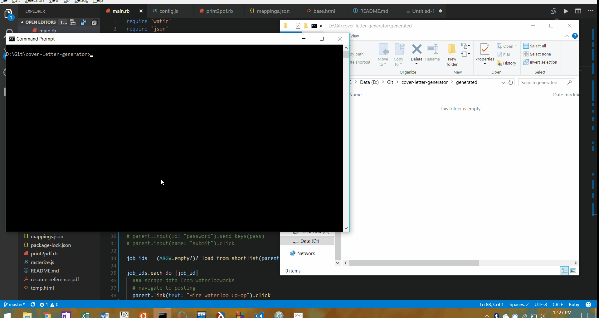

# cover-letter-generator

Ruby script to auto-generate cover letters for WaterlooWorks

Dependencies:
- ruby 2.3.x
- watir webdriver (`gem install watir`)
- [ChromeDriver](https://sites.google.com/a/chromium.org/chromedriver/) (add to your PATH)

You will also need to substitute your own mappings.json. `print2pdf.rb` can be used to convert the HTML files to PDFs after editing the cover letters.

